# PlaneToPBR — One-Click PBR Plane Generator for Blender


PlaneToPBR is a free Blender extension that generates a **fully textured PBR plane from a single image in one click**.

The extension automatically generates and applies:

- Diffuse
- Normal
- Roughness
- Depth
- Prompt-based segmentation mask

This allows artists to quickly convert reference images into usable **3D textured geometry**.

Compatible with Blender 4.2 and newer.

---

## Installation

1. Open **Blender**
2. Go to **Edit → Preferences**

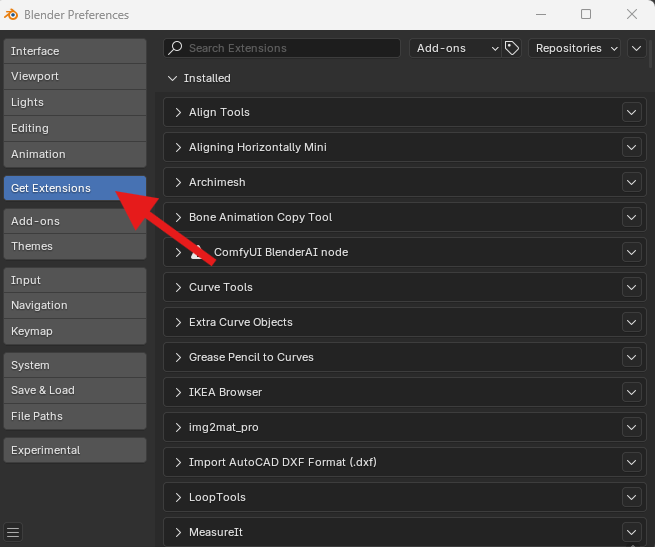

3. Click **Get Extensions**
4. Open the dropdown menu and select **Install from Disk**

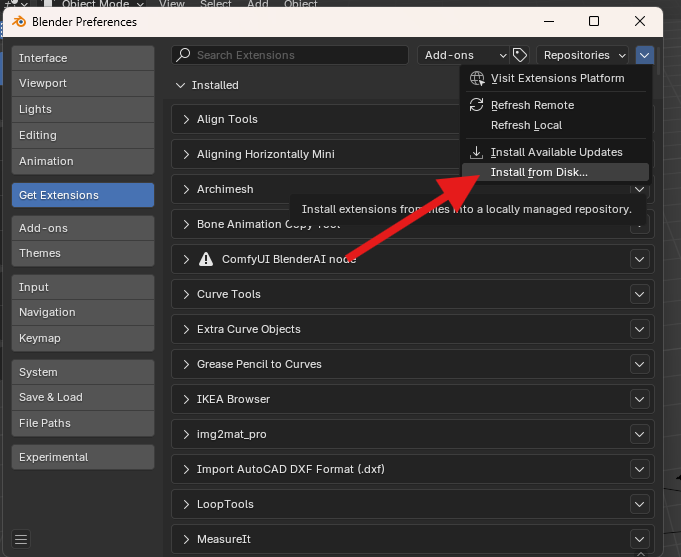

5. Select the `PlaneToPBR.zip` file

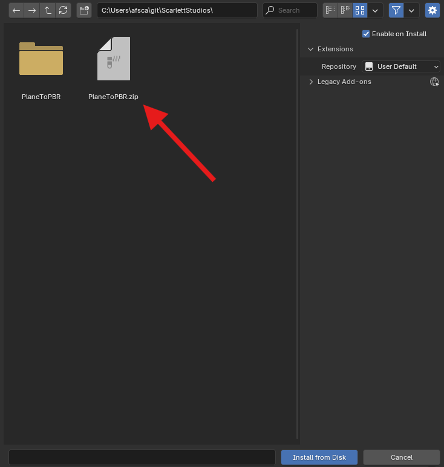

6. Enable the extension after installation.

---

## Using PlaneToPBR

After installing, open the **PlaneToPBR panel** in the 3D viewport sidebar.

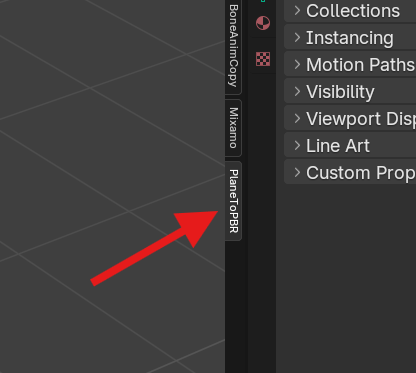

---
## UI Location

The panel is located in the **3D viewport sidebar**.

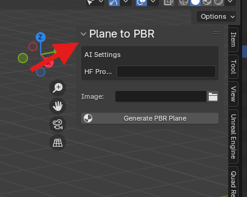

---


### Step 1 — Enter Prompt

Optionally enter a prompt to guide the AI segmentation.

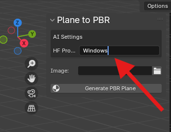

Example:

```
Windows
```

---

### Step 2 — Select Image

Click the file browser button and select your source image.

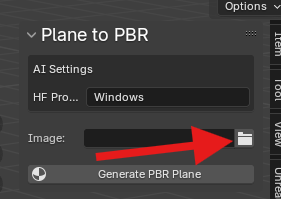

Then choose the image file.

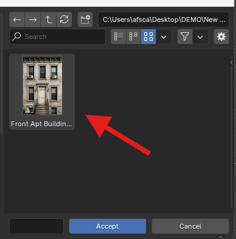

---

### Step 3 — Generate PBR Plane

Click **Generate PBR Plane**.

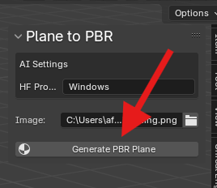

The add-on will:

1. Send the image to the AI pipeline  
2. Generate PBR maps  
3. Create a correctly scaled plane  
4. Build the material automatically  

---

## Generated Shader

The extension automatically builds a full **PBR shader network**.

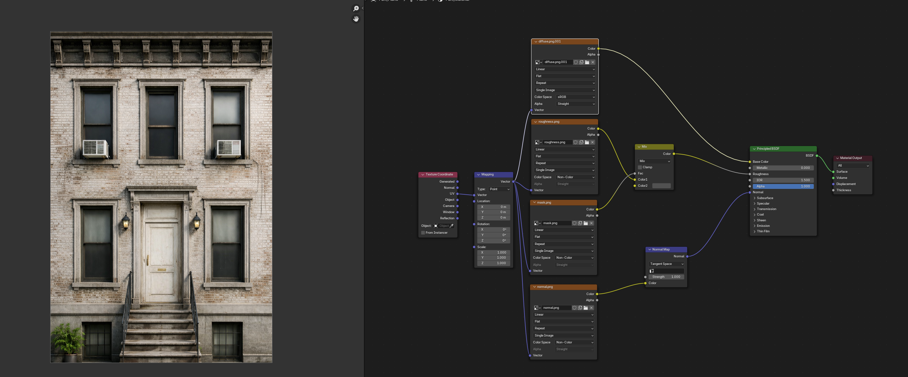

---

## Geometry Setup

For best depth results, adjust modifiers:

- Subdivision
- Displacement

Example settings:

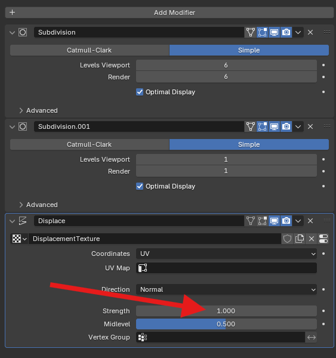

---

## Network Usage

PlaneToPBR sends the selected image to a remote AI inference service hosted on Hugging Face in order to generate PBR texture maps.

Only the image selected by the user is transmitted.  
No Blender project data or personal information is collected or stored.


---

## AI Models

PlaneToPBR relies on several open-source AI models:

| Model | Purpose | Repository |
|------|------|------|
| **CLIPSeg** | Text-guided segmentation (mask generation) | https://github.com/timojl/clipseg |
| **DeepBump** | Normal & roughness map generation | https://github.com/HugoTini/DeepBump |
| **MiDaS** | Depth estimation | https://github.com/isl-org/MiDaS |

## License

GPL-3.0-or-later


